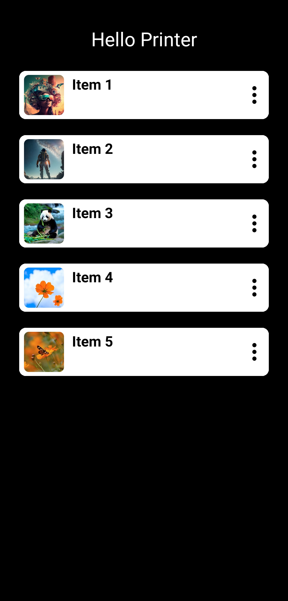
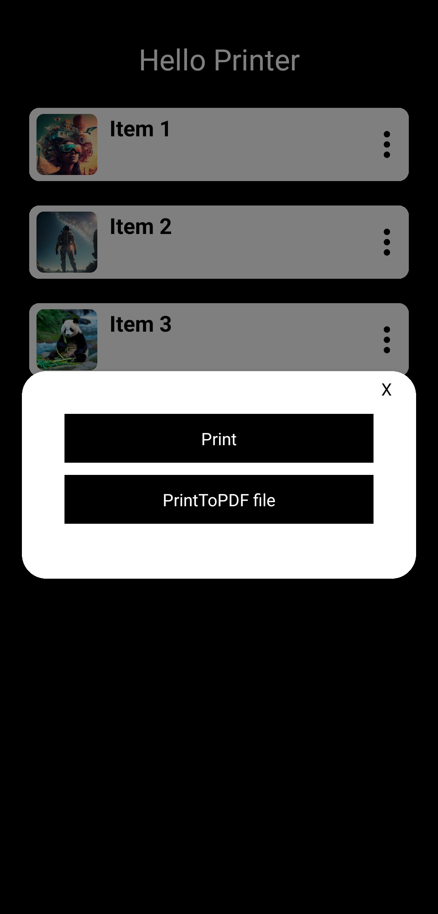
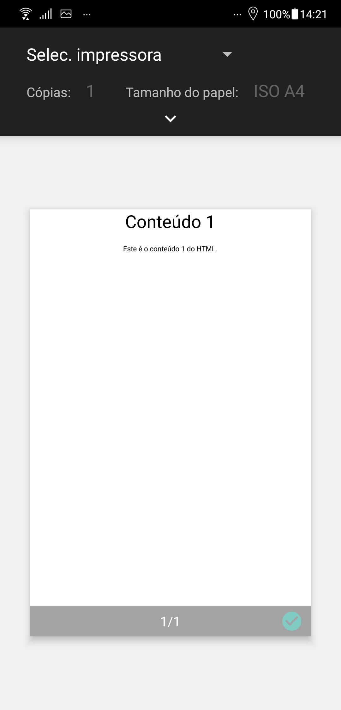

# Project Title: Printing Functionality with Expo Print

<table>
  <tr>
    <td></td>
    <td></td>
    <td></td>
  </tr>
</table>

## Overview
This project aims to implement printing functionality within a mobile application using Expo Print. The application is designed to allow users to print content directly from their mobile devices. To achieve this functionality, the project utilizes Expo Print API along with custom hooks, components, and mock data.

## Features
- **Printing Functionality**: Users can print content directly from the mobile application.
- **Custom Hook**: The application includes a custom hook named `usePrint` to manage the necessary functions for printing.
- **Separation of Concerns**: The code is organized using separate components such as `ListItem` and `Button` to improve code readability and maintainability.
- **Mock Data**: A mock data module is created to simulate an array of objects containing `title`, `html`, and `imageUrl` properties. This mock data is used in the `ListItem` component with a FlatList.

## Technologies Used
- React Native
- Expo Print
- TypeScript

## Getting Started
To run the application locally, follow these steps:

1. Clone the repository: `git clone https://github.com/your-repository.git`
2. Install dependencies: `npm install` or `yarn install`
3. Run the application: `expo start`

## Usage
1. Launch the application on a supported mobile device or emulator.
2. Navigate to the section where printing functionality is available.
3. Press the designated button to initiate printing.
4. Select the desired printer from the available options.
5. Confirm the print job and monitor the printing process.

## Additional Notes
- Ensure that the mobile device is connected to a compatible printer for printing functionality to work.
- Customize the mock data module to include real-world data as needed for testing and demonstration purposes.
- Explore additional features and optimizations to enhance the printing experience within the application.

## Contributors
- [Guilherme Monteiro](https://github.com/guimonteirojbv) - Developer

## License
This project is licensed under the [MIT License](LICENSE).

